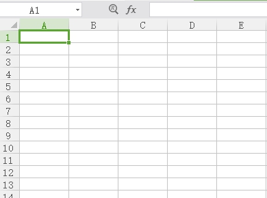

I have a picture

I have a excel

Duang~~ExcelPaint

## ExcelPaint
ExcelPaint是一个将图片转化为Excel文件的程序，没错，它就是干这个事情的
## 想法来源
之所以做这个是因为看到这样一张图片

## 工作原理
ExcelPaint主要由两部分代码构成，一个是将图片转化为RGB矩阵(参见PictureUtil.java)，另一个是将矩阵写入Excel(参见ExcelPaint.java)

Excel的部分使用了POI这个库
## 目前问题
Excel本身列的数目是有上限的，这里生成excel2003，所以暂时列数最大为256

Excel本身颜色的限制，所以能看到效果图片还是有很明显的失真，我直接使用的是POI里面findSimilarColor()方法来查找内置的相似颜色

